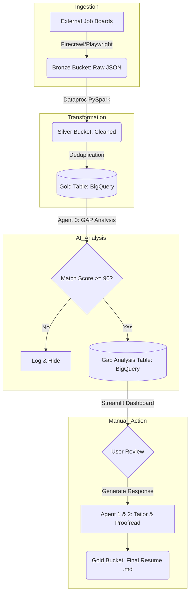

# ApplyIO: Pipeline Technical Documentation

This document serves as the primary technical reference for the `applyio` data and AI pipeline. It details the architectural patterns, data flow, security protocols, and observability mechanisms implemented.

---

## 1. Architectural Patterns

The system is built on three core architectural pillars:

### A. Medallion Architecture (Data Reliability)
We use a 3-layer storage pattern to ensure data integrity and traceability:
- **Bronze (Raw):** Immutable storage of scraped JSON/Markdown.
- **Silver (Cleaned):** Deduplicated and normalized data via PySpark.
- **Gold (Validated):** High-signal job postings ready for AI processing.

### B. Decoupled Control Plane
- **The Pipeline** (Ingestion/Analysis) and **The Dashboard** (Review/Action) are physically and logically separated.
- **Interconnect:** Google BigQuery acts as the shared persistent state (Source of Truth).
- **Benefit:** UI failures never halt data collection; scraper failures never block resume review.

### C. Human-in-the-Loop (HITL)
- **Gatekeeping:** AI does the heavy lifting (scoring/tailoring), but humans make the final "Apply" or "Ignore" decisions.
- **On-Demand Execution:** High-cost transitions (Resume Tailoring) are triggered manually to optimize token usage.

---

## 2. Pipeline Data Flow

The flow is orchestrated to move data from the "Wild Web" to a "Tailored Resume."

---

## 3. Security & Governance

### Identity & Access Management (IAM)
- **Principle of Least Privilege:** A single dedicated Service Account (`airflow-dataproc-sa`) holds strictly defined roles:
    - `BigQuery Data Editor`
    - `Storage Object Admin`
    - `AI Platform User` (Vertex AI)

### Authentication (ADC)
- **Local:** Uses `gcloud auth application-default login`.
- **Cloud:** Code automatically inherits the Service Account identity via metadata headers.
- **No Keys in Code:** Private `.json` key files are never committed or hardcoded.

### Remote Access Security (IAP)
- The Cloud Run dashboard is protected by **Identity-Aware Proxy (IAP)**.
- Only authenticated Google Workspace or @gmail.com accounts explicitly added to the IAM policy can see the application.

---

## 4. Agentic Workflow (The "Bouncer" Pattern)

The system uses a multi-agent hierarchy to ensure quality and cost control:

1.  **Agent 0 (The Bouncer):** Performs GAP analysis. It is highly efficient (`gemini-1.5-flash`) and acts as a filter. It identifies if the effort of tailoring is worth the cost.
2.  **Agent 1 (The Specialist):** Performs the complex tailoring task (`gemini-2.5-pro`). It focuses on nuance and JD alignment.
3.  **Agent 2 (The Editor):** A secondary LLM pass to proofread formatting, grammar, and ensure no hallucinations occurred during Agent 1's run.

---

## 5. Observability & Monitoring

### Audit Trails (BigQuery)
Every AI decision is logged in the `gap_analysis` table, including:
- **Rationale:** Why the score was given.
- **Strengths/Gaps:** Specific segments of the JD vs. Resume comparison.
- **Timestamps:** For performance and freshness tracking.

### Unified Logging
- Standardized logging format across all Python scripts.
- Logs are streamed to **Google Cloud Logging** (Stdout/Stderr) for real-time debugging.

### Health Checks
- Docker health checks in the `Dockerfile` verify that the Streamlit service is responsive before Cloud Run marks a revision as healthy.

---

## 6. Operational "Daily Ritual"

The system is currently configured for **Manual Operation** to give you maximum control:
1.  **Scrape & Gap:** Triggered via the "Pipeline Control" button in the dashboard.
2.  **Review:** Evaluate the 90%+ matches.
3.  **Tailor:** One-click resume generation for selected jobs.
4.  **Apply:** Mark status as "Applied" to sync the database.
